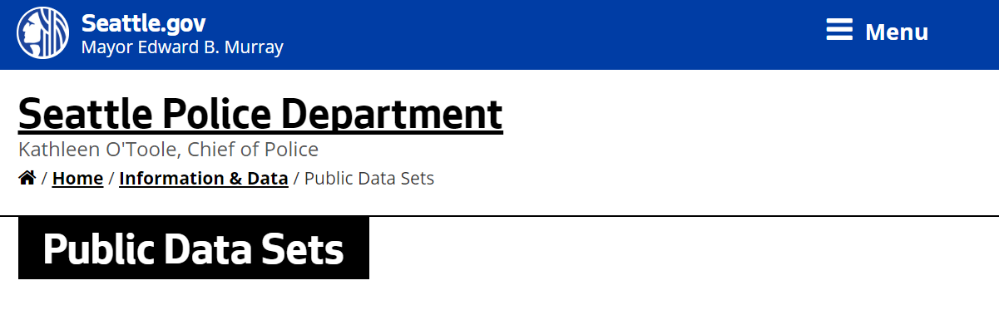

## Exploration of Seattle Crimes data

* our lesson will use data from the [City of Seattle](https://data.seattle.gov/) to explore database functionality
* the City of Seattle has information on all reported crimes incidents since 2011 [Crime Incidents](https://data.seattle.gov/Public-Safety/Crime-incidents-after-2011/8pyp-fumz)
* we will use a 2015 data table where each row is a different crime incident

<!---
  

 
--->

#### click [here](https://github.com/uwescience/SQL-geospatial-tutorial/blob/gh-pages/files/SeattleCrimeIncidents.csv) to access the comma-separated-value file

---
## Research Questions

In our examples for subsequent lessons, we will be guided by the following five research questions:

> ## Questions
> ### 1. How many "TRESPASS" offenses occurred in total?
> ### 2. What is the most common crime in the dataset?
> ### 3. Which month has the most crimes?
> ### 4. Which census track has the highest crime rate?
> ### 5. What is the most common crime within 5 km of my house?
{: .callout}

> ## Data Exploration (5 minutes)
> * Read through the 5 research questions above.
> * What method would you use, given what you know right now, to try to answer these questions?
> * What software would you use?
> * Within that software, what libraries or tools would you employ?
{: .challenge}