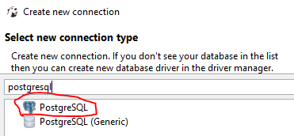
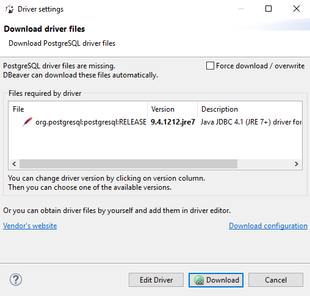

---

title: "Introduction"
teaching: 15
exercises: 0
questions:
- "In this exercise we will work on connecting to a database hosted on Amazon Web Services. Then we will practice issuing a few queries and start experimenting with SQL."
objectives:
- "Learn about the overall architecture of the HiMAT infrastructure"
key points:
- "Where you go to store and find data during HiMAT project depends on the data type, size and usage constraints"
- "Several methods/data centers are provided and users can choose which approach works best"
- "co-location of processing/analysis with data storage is encouraged, to minimize transfer of large files" 
---


## Step 1: Connecting to the DSSG tutorial database

#### Download software
We will use the [DBeaver](http://dbeaver.jkiss.org/download/) software to connect to the database.

* Windows - [click here](http://dbeaver.jkiss.org/files/dbeaver-ce-latest-x86_64-setup.exe) and download the file to install the application

* Mac OSX - [click here](http://dbeaver.jkiss.org/files/dbeaver-ce-latest-macos.dmg) and download the file to install the application

* Linux - [click here](http://dbeaver.jkiss.org/files/dbeaver-ce_latest_amd64.deb) and download the file to install the application

Start DBeaver.

#### Connect to the database

1. Click on the database icon:
<br><br>

<br><br><br><br>
2. Search `postgresql` as connection type.
<br><br>

<br><br><br><br>
3. Fill in the connection information.

- The host name is: someurl.amazonaws.com
- The port is: 5432
- The username is: some_username
- The password is: somepassword
<br><br>

<br><br><br><br>
4. Click `Test Connection ...` to ensure that you have entered the correct credentials.
<br><br>
5. You might get prompted with the download driver files window if this is your first time using postgresql.
Click on Download and follow the instructions.
<br><br>

<br><br><br><br>
6. If everything is connected you will get a success message.
<br><br>

<br><br><br><br>
7. Keep pressing next on the connection window, until finish. Once you are through, you will see the following when expanded.
We only need to access the tables. Double click on `seattlecrimeincidents` table, then to `Data` tab so see the data.
Take some time to become familiar with the contents of the table.
<br><br>

<br><br><br><br>

## Step 2: Issuing your first queries

Queries can be issued to the database in many different ways. Here we'll use the SQL query window in pg_admin. This is a great way to test out ideas before implementing your SQL queries in a script.

<br>
1. click on the "SQL Editor" button:
<br><br>

<br><br>
2. This should bring up a new tab:
<br><br>

<br><br>
The upper pane is where we will issue our query, and the results of the query will be shown in the results pane below.
<br><br>
3. Submit your first query by typing the following into the SQL pane:
<br><br>
```sql
SELECT * FROM seattlecrimeincidents LIMIT 100;
```

<br><br>
__NOTE:__ The "LIMIT" command restricts the database to return only the first 100 rows.
<br>
* the `*` is a wildcard requesting all columns from the database.
<br><br>

For example, we can apply the count function to all the columns:
<br><br>
```sql
SELECT count(*) FROM seattlecrimeincidents;
```
<br><br>

This gives us the number of the rows in the table.


## Step 3: Practice problems
* Try to write a query to answer our first question from our data exploration effort with the original .csv file:

 _How many "TRESPASS" offenses occurred in total?_

Hint: substitude < > with the appropriate variable or SQL command below
```sql
SELECT < > FROM seattlecrimeincidents WHERE < > = < > 
```
* Can you obtain the range of the latitude and longitude coordinates of all crimes? 

 Hint: use "max" and "min" functions.

* Extra. Combine a few conditions together:

 _What is the number of bike thefts in the month of january?_

You can use this [cheatsheet](http://www.sql-tutorial.net/sql-cheat-sheet.pdf) to look up the different SQL commands.


 

