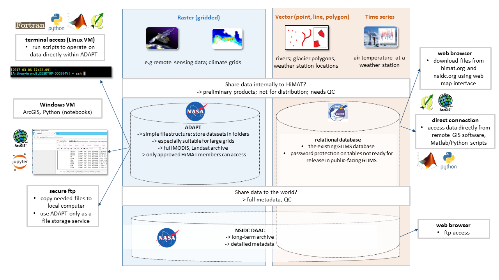

---

title: "Introduction"
teaching: 15
exercises: 0
questions:
- "What is the point in setting all of this up?"
- "Who are the clients and what are some typical use cases?"
- "What methods are in place to ensure my data are safe?"
- "What kinds of support and services can I expect from each of the different data coordinators?"
- "How can I work to help this progress as smoothly as possible?"
objectives:
- "review different categories of data (raster, vector, time series)"
- "learn which data centers will be responsible for handling each kind of data"
- "learn best practices to ensure data transfer and access occurs smoothly across the team"
key points:
- "Where you go to store and find data during HiMAT project depends on the data type, size and usage constraints"
- "Several methods/data centers are provided and users can choose which approach works best"
- "co-location of processing/analysis with data storage is encouraged, to minimize transfer of large files" 
---

## Overview

 

 

<!---
https://github.com/aaarendt/2016-11-29-HiMAT/blob/gh-pages/files/read_nc.ipynb
--->

