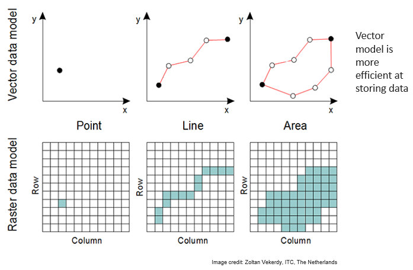

---

title: "Data Types"
teaching: 10
exercises: 0
questions:
- "What different data types will be used by HiMAT?"
objectives:
- "review different categories of data (raster, vector, time series)"
- "learn which data centers will be responsible for handling each kind of data"
- "learn best practices to ensure data transfer and access occurs smoothly across the team"
keypoints:
- "Usage of various HiMAT resources will vary depending on the type of data being analyzed"
---

The location and method by which we store data for HiMAT depends to a large extent on the type and size of the dataset. In general there are two primary types of geospatial data models, raster and vector. Raster data are used to represent continually varying fields while vector data represent discrete objects in space.

 

 

In addition we will discuss data that are well represented in tabular (row/column) format but do not contain geospatial encoding, such as a time series of weather station data.

### Raster/gridded/array data

Raster, gridded or array data all use a space-filling model, where all features are represented by discreet cells, arranged in a specific sequence. [Geospatial raster datasets](https://geohackweek.github.io/raster/01-introduction/) are effectively matrices with additional metadata to show which part of the planet the dataset represents. These include datasets like Landsat imagery. Typically we use the term [multidimensional array datasets](https://geohackweek.github.io/nDarrays/01-introduction/) to refer to those arrays representing variables spanning more than two dimensions, such as gridded climate data.

Common formats for storing these datasets include geotiffs, netCDF and HDF5. For HiMAT we encourage the use of netCDF or variations thereof (HDF5) because these are self-describing and machine independent. The majority of HiMAT datasets will involve remote sensing and model simulation output, both of which produce large array-based datasets. 

### Vector Data

Vector is a term commonly used in Geographical Information Systems (GIS) to refer to discrete geometric entities (also referred to as objects, features or shapes) that represent or approximate distinct "things" in space. [Vector data models](https://geohackweek.github.io/vector/02-geospatial-concepts/) include point, line and polygon features. 

There are [many different ways](https://geohackweek.github.io/vector/03-encodings-libraries/) to encode vector data. For HiMAT we encourage the use of open-source formats such as GeoJSON.

Example datasets will include vector polygons representing glacier locations, points representing HMA weather stations and lines representing stream locations.

### Tabular Data

All other non-geospatially encoded data will be represented in tabular (row/column) format. Simple machine-independent formats are recommended, such as comma-separated-values.

