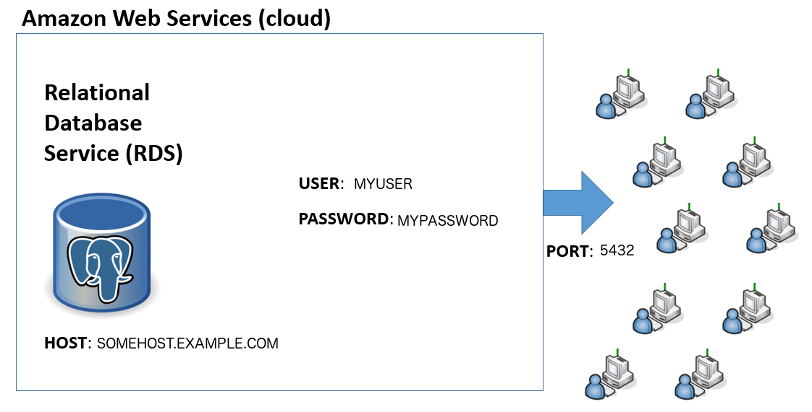

# What is a database? 

* a database is a software system for _capturing_, _storing_ and _analyzing_ data. 
* nearly all databases use the _relational_ data model in which information is structured in row and column format: 

<br><br>

<br><br><br>

## Motivation for using a database

* fast searching
* powerful methods for performing analysis on groups of data
* capability of joining information between datasets
* data types have unique functionality (e.g. dates are not just integers but have methods related to year, month, day)
* centralized repository, minimizes duplication, controlled access across multiple users
* optional: geospatial encoding  

## The relational data model:

* there are many different flavors of databases but the most well developed is the _relational_ data model
   * each record has a unique identifier (primary key)
   * data are manipulated using _Structured Query Language_ (SQL):   

## Structured Query Language (SQL):
* standard language for relational databases
* across different databases the core syntax is similar but there are small differences in some function names

## Creating a database table:

* before adding any data to a database it is necessary to create a table
* here is an example using some of the information from our sample crimes dataset:

```SQL
CREATE TABLE seattlecrimesincidents 
    ("crimesID" int,
     "Offense type" character,
     "Offense code" int,
     "Date" timestamp,
     "Location" character); 
```

* this command creates an empty table:

<br>
<hr>
<br>

<br>
<hr>
<br>

### Data Types

* all data in a column must be of the same data type
* this is required by SQL so that the database knows how to operate on the data in a consistent way
* here are a few common [data types](https://www.postgresql.org/docs/9.4/static/datatype.html):

| Name | Aliases | Description |
| --- | --- | --- |
|  boolean | bool | logical Boolean (true/false) |
| character | char | fixed-length character string |
| date |  | calendar date (year, month, day) |
| double precision | float8 | double precision floating-point number (8 bytes) |
| integer | int, int4 | signed four-byte integer |
| json  |  | JSON data |
| money |  | currency amount |
| timestamp |  | date and time (no time zone) |
| xml |  | XML data |

<br>
<hr>
<br>

## populating the database records:

* here's an example of how we can insert data into a database:

```SQL
INSERT INTO seattlecrimeincidents VALUES

    (1,'trespass', 5700,'2015-01-28 09:30:00','12XX Block of E Pike St'),
    
    (2,'larceny-theft',2300, '2015-02-21 08:24:21','15XX Block of Aurora St');
```

* note that the order of the values insterted matches the order in which the column names were created
* here is what the table looks like now:

<br>
<hr>
<br>

| crimesID | Offense type | Offense code | Date | Location | 
| ---- | ---- | ----- | ---- | ---- | ---- |
|   1 | tresspass | 5700 | 2015-01-28 09:30:00 | 12XX Block of E Pike St |
|   2 | larceny-theft | 2300 |  2015-02-21 08:24:21 | 15XX Block of Aurora St | 

<br>
<hr>
<br>

## Database rules:

* all databases adhere to strict rules about how the data are structured

### Normalization

* all row elements must contain a unique piece of information
* this [normalization](https://en.wikipedia.org/wiki/Database_normalization) of your tables will minimize redundancy
* for example, suppose we tried to list two offenses at the same time, in the same row: 

<br>
<hr>
<br>

| crimesID | Offense type | Offense code | Date | Location | 
| ---- | ---- | ----- | ---- | ---- | ---- |
|  1 | tresspass and burglary | 5700 and 5710 | 2015-01-28 09:30:00 | 12XX Block of E Pike St |
|  2 | larceny-theft | 2300 |  2015-02-21 08:24:21 | 15XX Block of Aurora St |

<br>
<hr>
<br>

* this is incorrect because the database will have problems searching these columns
* the solution to this problem is simply to create another row:

<br>
<hr>
<br>

| crimesID | Offense type | Offense code | Date | Location | 
| ---- | ---- | ----- | ---- | ---- | ---- |
|    1 |  tresspass |  5700 |   2015-01-28 09:30:00 |   12XX Block of E Pike St |
|    2 |   burglary |   5710 |   2015-01-28 09:30:00 |   12XX Block of E Pike St |
|    3 |  larceny-theft |  2300 |   2015-02-21 08:24:21 |   15XX Block of Aurora St |

<br>
<hr>
<br>

### NULL Values

* missing data are a common feature of many datasets
* many datasets encode missing data inconsistently (e.g. with "X" or -9999) 
* in this example, the code for "tresspass" is not known so the data entry is "X"

<br>
<hr>
<br>

| crimesID | Offense type | Offense code | Date | Location | 
| ---- | ---- | ----- | ---- | ---- | ---- |
|    1 |  tresspass |  X |   2015-01-28 09:30:00 |   12XX Block of E Pike St |
|    2 |   burglary |   5710 |   2015-01-28 09:30:00 |   12XX Block of E Pike St |
|    3 |  larceny-theft |  2300 |   2015-02-21 08:24:21 |   15XX Block of Aurora St |

<br>
<hr>
<br>

* to solve this, the relational databases introduced NULL values:
    * NULL is a state representing a lack of a value
    * NULL is not the same as zero!
    * NULL values are ignored in SELECT statements

<br>

### Selecting Data:

* one of the most common operations on a SQL table is to ```SELECT``` data
* here we select based on a specific offense code:

```SQL
SELECT "Offense type", "Offense code", "Date", "Location"
   FROM seattlecrimeincidents 
   WHERE "Offense code" = 5700;
```

* note we are using a "WHERE" clause to select specific rows

<br>
<hr>
<br>

| crimesID | Offense type | Offense code | Date | Location | 
| ---- | ---- | ----- | ---- | ---- | ---- |
|  1 | tresspass | 5700 | 2015-01-28 09:30:00 |  12XX Block of E Pike St |

<br>
<hr>
<br>

* this example shows how to use a comma separated list to select specific columns:

* selecting data:
```SQL
SELECT "Offense type", "Date" 
   FROM seattlecrimeincidents;
```

<br>
<hr>
<br>

| Offense type | Date | 
| ---- | ---- |
| tresspass |  2015-01-28 09:30:00 | 
| larceny-theft | 2015-02-21 08:24:21 |  

<br>
<hr>
<br>

## Functions

* databases have a wide range of functions that can operate on row elements
* one of the most common functions is to extract a subset of a date (e.g. year, hour) from a column with type = "timestamp"

<br>
<hr>
<br>

```SQL
SELECT "Date Reported", date_part('hour', "Date Reported")
FROM seattlecrimeincidents
LIMIT 5;
```

<br>
<hr>
<br>

* Databases also have aggregate functions used on sets of data
* examples include SUM(), MAX(), MIN(), AVG(), COUNT(), STDDEV()

## Data Analysis:

* databases have powerful methods for analyzing data
* one of the most common tasks: applying statistics across groups
* to accomplish this we need to learn 
    * how to GROUP sets of data
    * how to apply statistical functions to those groups


<br>
<hr>
<br>

| crimesID |  Offense code | Date | Location | Damage | 
| ---- |  ----- | ---- | ---- | ---- | ---- |
|    1 | 5700 |   2015-01-28 09:30:00 |   12XX Block of E Pike St |  \$1,220 | 
|    1 | 5700 |   2015-02-12 03:25:00 |   1XX Block of Aloha St |  \$11,420 |
|    2 |   5710 |   2015-01-28 09:30:00 |   12XX Block of E Pike St |  \$5,389 |
|    2 |   5710 |   2015-1-02 12:31:20 |   12XX Block of E Pine St |  \$15,231 |
|    3 |  2300 |   2015-02-21 08:24:21 |   15XX Block of Aurora St |  \$2,405 |

<br>
<hr>
<br>

* suppose we aslk: "What is the total damage that occurred for each offense type?""
* to answer this, first we need to group the data by "Offense code":

<br>
<hr>
<br>

<br>
<hr>
<br>

```SQL
SELECT SUM("Damage") 
   FROM seattlecrimeincidents
   GROUP BY "Offense code";
```

<br>
<hr>
<br>

| Offense code | totalDamage | 
|   ---- | ---- |
|  5700  | \$12,640 | 
|  5710 | \$20,620 |
|  2300  | \$2,405 |

<br>
<hr>
<br>

#### Column aliasing:
* often we want to rename newly generated columns:

```SQL
SELECT "Date Reported", date_part('hour', "Date Reported") AS "reported hour"
FROM seattlecrimeincidents
LIMIT 5;
```

<br>
<hr>
<br>

| Date Reported | reported hour |
| ----- | ----- |
| 2015-01-28 09:30:00 | 9.0 |
| 2015-01-28 11:05:00 | 11.0 |
| 2015-01-29 19:57:00 | 19.0 |
| 2015-01-28 15:17:00  | 15.0 |
| 2015-01-27 04:25:00 | 4.0 |

<br>
<hr>
<br>

### Joining Tables

* well designed databases distribute data across multiple tables, for efficiency
* then we can JOIN data between tables as needed

<br>
<hr>
<br>

<br>
<hr>
<br>

### Database Implementation:

* there are many relational database software implementations:
   * commercial: Oracle, Microsoft SQL Server, IBM DB2 
   * open source: MySQL, PostgreSQL

 * regardless of the software:
   * most databases are deployed on a server 
   * can deploy locally for testing

### Database Interface:

* all databases are accessed via a _connection string_:
   * hostname, port, user, password

<br>
<hr>
<br>

<br>
<hr>
<br>

   
