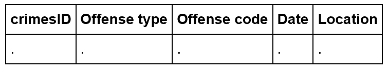

---

title: "Introduction to Databases"
teaching: 15
exercises: 0
questions:
- "What is a database?"
- "How are data structured within a database?"
- "What are the advantages of working with data in a database?"
objectives:
- "Learn the fundamentals of the relational data model"
- "Begin to identify in which cases it makes sense to put your data in a database"
- "Learn a bit of Structured Query Language (SQL)"
- "Learn about some of the specific rules of how to structure a database"
keypoints:
- "Databases offer a highly structured framework for storing and manipulating data"
- "Setting up this structure takes some time"
- "Advantages include the ability to investigate complex relationships between data using a simple query language"
---

# What is a database? 

* a database is a software system for _capturing_, _storing_ and _analyzing_ data. 
* nearly all databases use the _relational_ data model in which information is structured in row and column format: 

<br><br>

<br><br><br>

Within the relational data model:

* each record has a unique identifier (primary key)
* data are manipulated using _Structured Query Language_ (SQL):   

## Creating a database table:

* before adding any data to a database it is necessary to create a table
* here is an example using some of the information from our sample crimes dataset:

```SQL
CREATE TABLE seattlecrimesincidents 
    ("crimesID" int,
     "Offense type" character,
     "Offense code" int,
     "Date" timestamp,
     "Location" character); 
```

* this command creates an empty table:

<br>
<hr>
<br>

<br>
<hr>
<br><br><br>

### Data Types

* all data in a column must be of the same data type
* this is required by SQL so that the database knows how to operate on the data in a consistent way
* here are a few common [data types](https://www.postgresql.org/docs/9.4/static/datatype.html):

| Name | Aliases | Description |
| --- | --- | --- |
|  boolean | bool | logical Boolean (true/false) |
| character | char | fixed-length character string |
| date |  | calendar date (year, month, day) |
| double precision | float8 | double precision floating-point number (8 bytes) |
| integer | int, int4 | signed four-byte integer |
| json  |  | JSON data |
| money |  | currency amount |
| timestamp |  | date and time (no time zone) |
| xml |  | XML data |

<br>
<hr>
<br>

## populating the database records:

* here's an example of how we can insert data into a database:

```SQL
INSERT INTO seattlecrimeincidents VALUES

    (1,'trespass', 5700,'2015-01-28 09:30:00','12XX Block of E Pike St'),
    
    (2,'larceny-theft',2300, '2015-02-21 08:24:21','15XX Block of Aurora St');
```

* note that the order of the values insterted matches the order in which the column names were created
* here is what the table looks like now:

_____

| crimesID | Offense type | Offense code | Date | Location | 
| ---- | ---- | ----- | ---- | ---- | ---- |
|   1 | tresspass | 5700 | 2015-01-28 09:30:00 | 12XX Block of E Pike St |
|   2 | larceny-theft | 2300 |  2015-02-21 08:24:21 | 15XX Block of Aurora St | 

______
<br><br>


## Database rules:

* all databases adhere to strict rules about how the data are structured

### Normalization

* all row elements must contain a unique piece of information
* this [normalization](https://en.wikipedia.org/wiki/Database_normalization) of your tables will minimize redundancy
* for example, suppose we tried to list two offenses at the same time, in the same row: 

<br>
<hr>
<br>

| crimesID | Offense type | Offense code | Date | Location | 
| ---- | ---- | ----- | ---- | ---- | ---- |
|  1 | tresspass and burglary | 5700 and 5710 | 2015-01-28 09:30:00 | 12XX Block of E Pike St |
|  2 | larceny-theft | 2300 |  2015-02-21 08:24:21 | 15XX Block of Aurora St |

<br>
<hr>
<br>

* this is incorrect because the database will have problems searching these columns
* the solution to this problem is simply to create another row:

<br>
<hr>
<br>

| crimesID | Offense type | Offense code | Date | Location | 
| ---- | ---- | ----- | ---- | ---- | ---- |
|    1 |  tresspass |  5700 |   2015-01-28 09:30:00 |   12XX Block of E Pike St |
|    2 |   burglary |   5710 |   2015-01-28 09:30:00 |   12XX Block of E Pike St |
|    3 |  larceny-theft |  2300 |   2015-02-21 08:24:21 |   15XX Block of Aurora St |

<br>
<hr>
<br>

### NULL Values

* missing data are a common feature of many datasets
* many datasets encode missing data inconsistently (e.g. with "X" or -9999) 
* in this example, the code for "tresspass" is not known so the data entry is "X"

<br>
<hr>
<br>

| crimesID | Offense type | Offense code | Date | Location | 
| ---- | ---- | ----- | ---- | ---- | ---- |
|    1 |  tresspass |  X |   2015-01-28 09:30:00 |   12XX Block of E Pike St |
|    2 |   burglary |   5710 |   2015-01-28 09:30:00 |   12XX Block of E Pike St |
|    3 |  larceny-theft |  2300 |   2015-02-21 08:24:21 |   15XX Block of Aurora St |

<br>
<hr>
<br>

* to solve this, the relational databases introduced NULL values:
    * NULL is a state representing a lack of a value
    * NULL is not the same as zero!
    * NULL values are ignored in SELECT statements

<br>

### Selecting Data:

* one of the most common operations on a SQL table is to ```SELECT``` data:

```SQL
SELECT * 
   FROM seattlecrimeincidents 
   WHERE "Offense code" = 5700;
```

* use a "WHERE" clause to select specific rows

| crimesID | Offense type | Offense code | Date | Location | 
| ---- | ---- | ----- | ---- | ---- | ---- |
|  1 | tresspass | 5700 | 2015-01-28 09:30:00 |  12XX Block of E Pike St |

* selecting data:
```SQL
SELECT "Offense type", "Date" 
   FROM seattlecrimeincidents;
```

* use a comma separated list to select specific columns

| Offense type | Date | 
| ---- | ---- |
| tresspass |  2015-01-28 09:30:00 | 
| larceny-theft | 2015-02-21 08:24:21 |  

## Functions: databases have a wide range of functions that can operate on row elements

#### Example:
* use a function to extract a subset of a date (e.g. year, hour) from a column with type = "timestamp"

```SQL
SELECT "Date Reported", date_part('hour', "Date Reported")
FROM seattlecrimeincidents
LIMIT 5;
```

