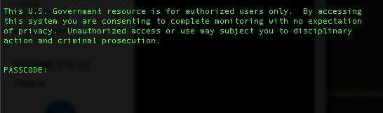
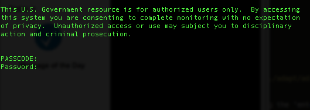
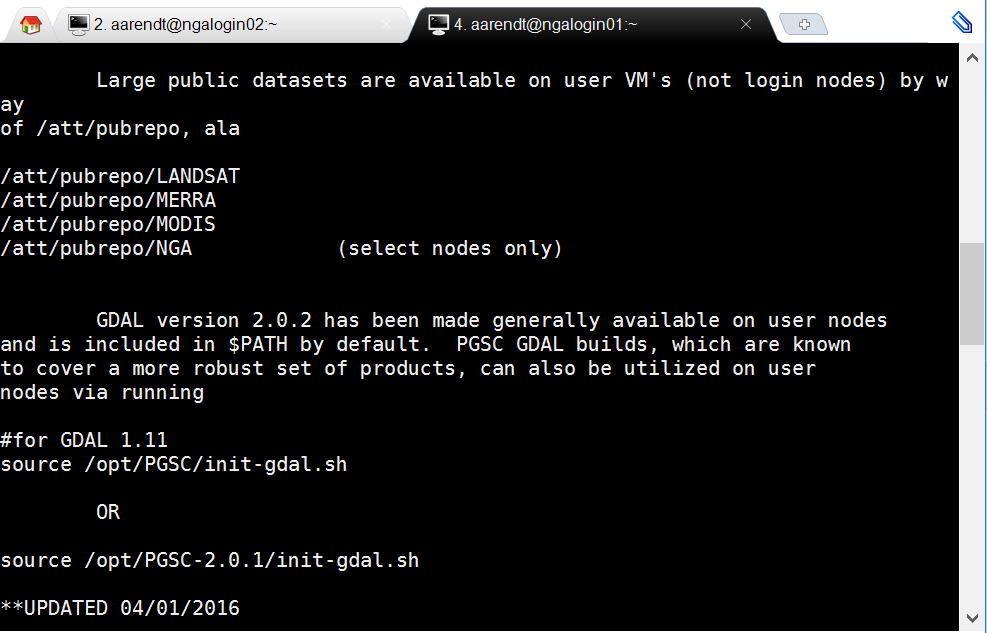

---

title: "NASA ADAPT: Overview"
teaching: 20
exercises: 0
questions:
- "What is ADAPT?"
- "How do I access ADAPT?"
- "Which datasets should I store on ADAPT?"
objectives:
- "Learn the overall architecture of ADAPT"
- "Learn how to login to ADAPT"
- "Understand the concept of Virtual Machines and different Operating Systems on ADAPT"
keypoints:
- "We will use ADAPT primarily to store and process large gridded datasets"

---

## Overview

NASA has numerous on-site computing centers to assist researchers with computational tasks. Until now most of these have provided high performance computing for modeling studies. The NASA Center for Climate Simulation (NCCS) is one such facility, providing resources for large climate simulation projects. 

Recently there has been a need to expand these resources to facilitate analysis of products generated by high performance computing tasks. Therefore the NCCS created the Advanced Data Analytics Platform ([ADAPT](https://www.nccs.nasa.gov/services/adapt)), which is an on-site private cloud designed for large-scale data analytics. This system provides researchers with tools they need to visualize and process the large datasets from multiple platforms and models.

All HiMAT researchers have an opportunity to access these ADAPT resources. Team members must pass through a screening and security [process](https://www.nccs.nasa.gov/services/adapt/user_access/how_do_i_get_access) and receive approval from the team lead and NASA administrators. 

## HiMAT ADAPT Architecture

ADAPT is a [managed Virtual Machine](https://www.nccs.nasa.gov/services/adapt/capabilities) (VM) environment. Each user who is given access to ADAPT also gains access to a series of VMs, each running autonomously and dedicated to a specific project. For the HiMAT project we have provisioned approximately 15 Virtual Machines (VMs) for our work. These are labeled "himat101, himat102,..." etc. Each of these VMs is identical to the other. The reason we have multiple VMs is you can switch between them if one is being used by another team. 

> ## How do I decide which VM to use?
>
> Occasionally other users may be running large jobs on certain himat VMs, so you will want to select one that is not being used. You can 
> figure this out by accessing the NASA ["ganglia"](https://www.nccs.nasa.gov/internal/monitoring/dsc/ganglia-test/) page, which presents 
> series of graphs showing CPU and memory usage (you will need to enter your credentials again).
{: .callout}

## Connecting to ADAPT

There are two main steps to getting connected with ADAPT resources:

1. established a secured connection between your computer and ADAPT servers.
2. choose which *virtual* operating system you would like to use (Linux or Windows). Note that this choice is entirely independent of the operating system of your local computer (i.e. the system from which you are establishing the connection).

### Establishing A Secured Connection

All ADAPT users must connect to NASA servers through a "Secure Shell" (SSH) connection. An SSH connection sets up a secured portal between your computer and NASA servers based on verification of your security credentials. These credentials include the user ID, RSA Token, passcode and  password provided by NASA. 

Establishing an SSH connection requires typing your various credentials into a terminal prompt. The way in which you do this will vary based on the operating system of your local computer:

* for MAC or Linux users: simply pull up a terminal prompt
* for Windows users: download [MobaXterm](http://mobaxterm.mobatek.net/), a software that enables SSH terminal access from Windows

From your terminal prompt, login to ADAPT:

~~~
$ ssh -XC <userID>@ngalogin.nccs.nasa.gov
~~~
{: .bash}

The "-X" option is needed later if you use any of the Graphical User Interfaces offered by ADAPT, and "-C" is a data compression option which we have found to reduce the lag introduced when running some software like QGIS.

Now you will be asked for your passcode. Your passcode consists of your RSA PIN, followed by your RSA TOKEN (i.e. the 6 numbers currently showing on your securID RSA device), all entered in at once on the same line.

 

 

Next, enter your LDAP password:

 

 

(Note that these instructions are also explained [here](https://www.nccs.nasa.gov/services/adapt/how_to_use_adapt/logging_into_adapt)).

Once you have successfully entered your credentials you will see a few lines of text like this:
 
 

 

And your command prompt will now look like this:

~~~
[<userID>@ngalogin02 ~] $
~~~
{: .bash}

For new users, this step can be initially confusing. Once passing through these initial security requests it will seem that you are now "in" to ADAPT and ready to work. But really you are just through the first layer of security, sitting on the ngalogin server, from which you now must to make another secure connection to the VM environment where you will your work. You will have two choices regarding that environment: Linux or Windows. This is the topic of the following two lessons.

## Recommended Practices with HiMAT-ADAPT

HiMAT should expect to use ADAPT primarily for the following:

* as a centralized location for accessing existing NASA remote sensing and climate products like Landsat, MODIS, MERRA
* as a repository for sharing raster/gridded products generated by HiMAT, such as high resolution DEMs, preliminary remote sensing results, model output
* as an environment for visualizing, quality checking, subsetting and performing preliminary analysis on HiMAT products
* as a reource for running large computational tasks

