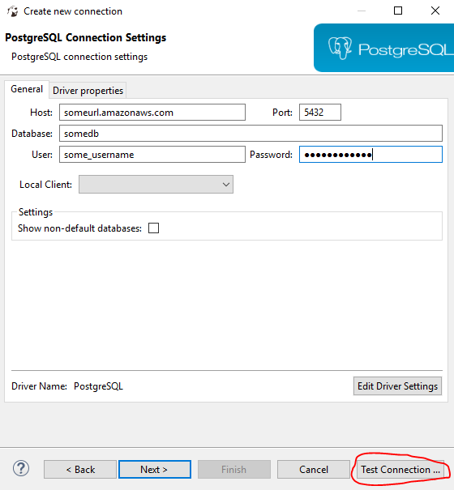
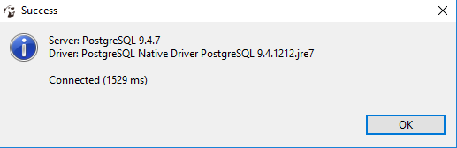
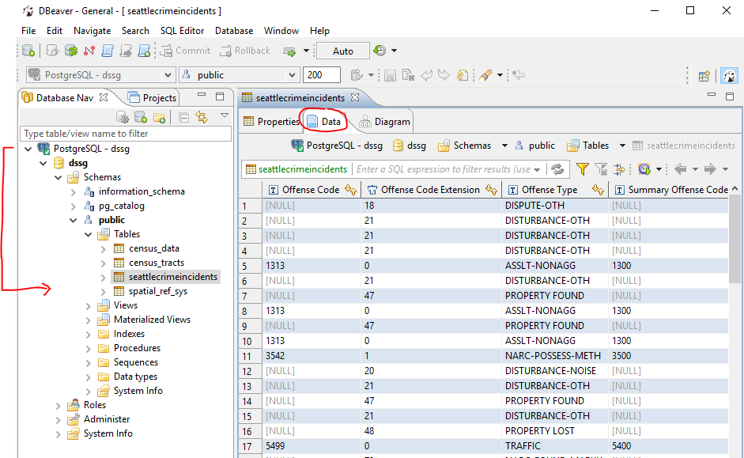

## Step 1: Connecting to the DSSG tutorial database

#### Download software
We will use the [DBeaver](http://dbeaver.jkiss.org/download/) software to connect to the database.

* Windows - [click here](http://dbeaver.jkiss.org/files/dbeaver-ce-latest-x86_64-setup.exe) and download the file to install the application

* Mac OSX - [click here](http://dbeaver.jkiss.org/files/dbeaver-ce-latest-macos.dmg) and download the file to install the application

* Linux - [click here](http://dbeaver.jkiss.org/files/dbeaver-ce_latest_amd64.deb) and download the file to install the application

* once you have the software installed, start DBeaver

#### Connect to the database

1. Click on the database icon:
  

    
2. Search `postgresql` as connection type.
  

    
3. Fill in the connection information.

- The host name is: someurl.amazonaws.com
- The port is: 5432
- The username is: some_username
- The password is: somepassword
  

    
4. Click `Test Connection ...` to ensure that you have entered the correct credentials.
  
5. You might get prompted with the download driver files window if this is your first time using postgresql.
Click on Download and follow the instructions.
  

    
6. If everything is connected you will get a success message.
  

    
7. Keep pressing next on the connection window, until finish. Once you are through, you will see the following when expanded.
We only need to access the tables. Double click on `seattlecrimeincidents` table, then to `Data` tab so see the data.
Take some time to become familiar with the contents of the table.
  

    
