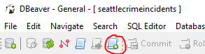

---

title: "Queries"
teaching: 15
exercises: 0
questions:
- "How do I connect to a cloud-based relational database?"
- "How do I issue basic queries?"
objectives:
- "Learn how to connect to a relational database using a graphical user interface called dBeaver"
- "Become acquainted with a few simple SQL queries"
key points:
- "dBeaver provides a simple interface for viewing database tables and testing SQL queries"
---

## Issuing your first queries

Queries can be issued to the database in many different ways. Here we'll use the SQL query window in DBeaver. This is a great way to test out ideas before implementing your SQL queries in a script.

<br>
1. click on the "SQL Editor" button:
<br><br>

<br><br>
2. This should bring up a new tab:
<br><br>

<br><br>
The upper pane is where we will issue our query, and the results of the query will be shown in the results pane below.
<br><br>
3. Submit your first query by typing the following into the SQL pane:
<br><br>
```sql
SELECT * FROM seattlecrimeincidents LIMIT 100;
```

<br><br>
__NOTE:__ The "LIMIT" command restricts the database to return only the first 100 rows.
<br>
* the `*` is a wildcard requesting all columns from the database.
<br><br>

For example, we can apply the count function to all the columns:
<br><br>
```sql
SELECT count(*) FROM seattlecrimeincidents;
```
<br><br>

This gives us the number of the rows in the table.


# Step 3: Practice problems

> ## SQL example #1
>
> Try to write a query to answer our first question from our data exploration effort with the original .csv file:
>
> ~~~
> SELECT ? FROM ?
> ~~~
> {: .sql}
>
> > ## Solution
> >
> > Here is the solution
> >
> > ~~~
> > SELECT COUNT(*) FROM
> > ~~~
> > {: .sql}
> {: .solution}
{: .challenge}

> ## How many "TRESPASS" offenses occurred in total?
> Hint: substitude with the appropriate variable or SQL command below
{: .challenge}

>## Calculating several values at a time
>_What is the range of the latitude and longitude coordinates of all crimes?_
> Hint: use "max" and "min" functions.
{: .challenge}


>## Combining conditions
>_What is the number of bike thefts in the month of january?_
{: .challenge}

You can use this [cheatsheet](http://www.sql-tutorial.net/sql-cheat-sheet.pdf) to look up the different SQL commands.

# Grouping discussion
> TODO: Add some conceptual stuff about grouping

* Count how many offenses are for each Offense Type
>~~~
>select "Offense Type",count(*) from SeattleCrimeIncidents group by "Offense Type" order by count ASC;
>~~~
>{: .sql}

Note: for homicide we see there are a lot of types of homicides -> use summarized offense description

* Count how many offenses are for each Summarized Offense Description
>~~~select "Summarized Offense Description", count(*) from SeattleCrimeIncidents
	group by "Summarized Offense Description";
>~~~
>{: .sql}

* Count how many offenses per year
>~~~
>select year, count(*) from SeattleCrimeIncidents
	group by year;
>~~~
>{: .sql}


>## Crimes for each month?
>>##Solution
>>
>>~~~
>>SELECT month,count(*) FROM seattlecrimeincidents GROUP BY month ORDER BY month ASC
>>~~~
>>{: .sql}
>{: .solution}
{: .challenge}


>## Month with highest number of bike thefts?
>>##Solution
>>~~~SELECT month,count(*) FROM seattlecrimeincidents
	WHERE "Offense Type" = 'THEFT-BICYCLE'
	GROUP BY month
	ORDER BY count DESC
>>~~~
>>{: .sql}
>{: .solution}
{: .challenge}

>## Number of crimes per census tract?
>>##Solution
>>~~~
>>SELECT "census tract 2000",count(*) FROM seattlecrimeincidents
	group by "census tract 2000"
	ORDER BY "census tract 2000" ASC;
>>~~~
>>{: .sql}
>{: .solution}
{: .challenge}

 


---

title: "Introduction to Databases"
teaching: 15
exercises: 0
questions:
- "What is a database?"
- "How are data structured within a database?"
- "What are the advantages of working with data in a database?"
objectives:
- "Learn the fundamentals of the relational data model"
- "Begin to identify in which cases it makes sense to put your data in a database"
- "Learn a bit of Structured Query Language (SQL)"
- "Learn about some of the specific rules of how to structure a database"
key points:
- "Databases offer a highly structured framework for storing and manipulating data"
- "Setting up this structure takes some time"
- "Advantages include the ability to investigate complex relationships between data using a simple query language"
---
