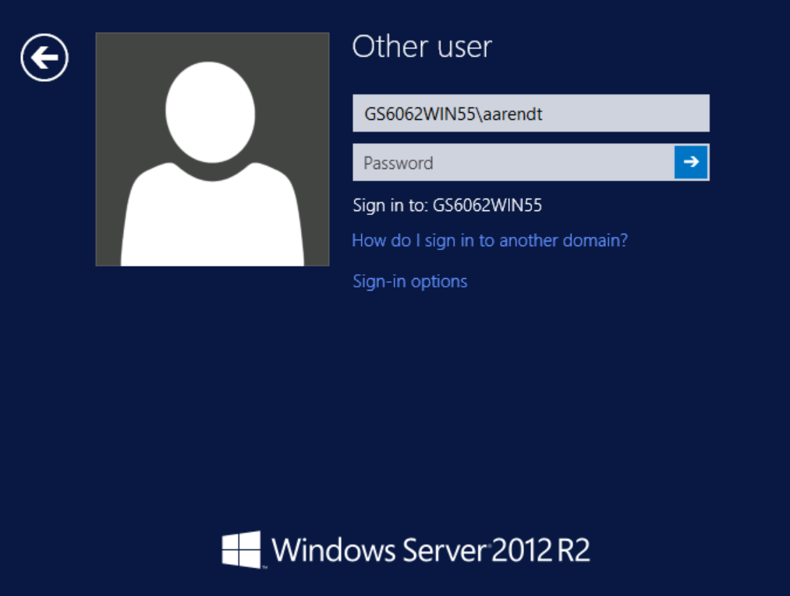
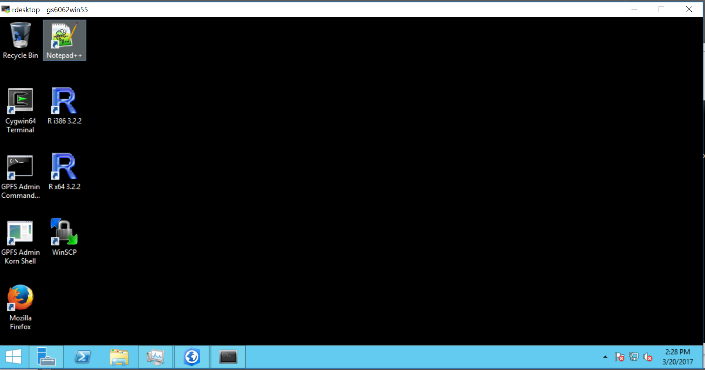
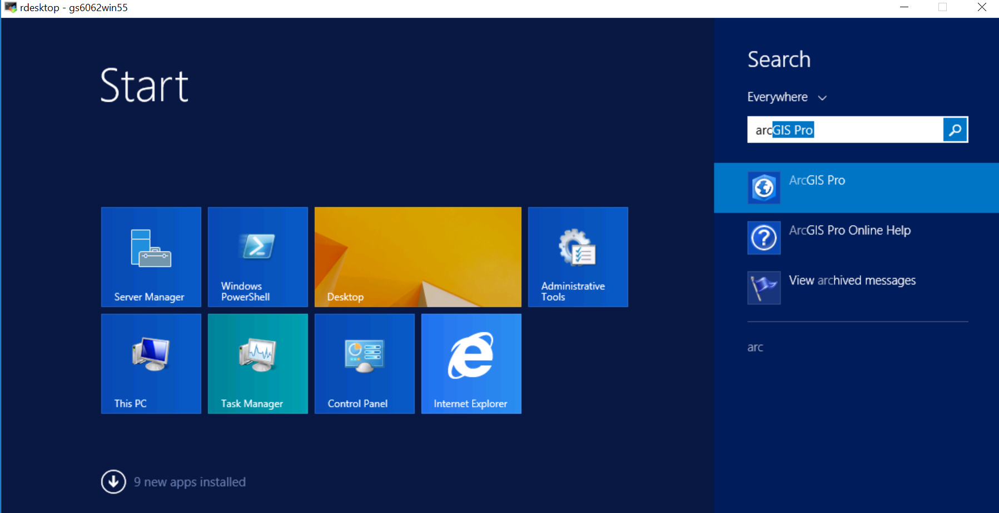
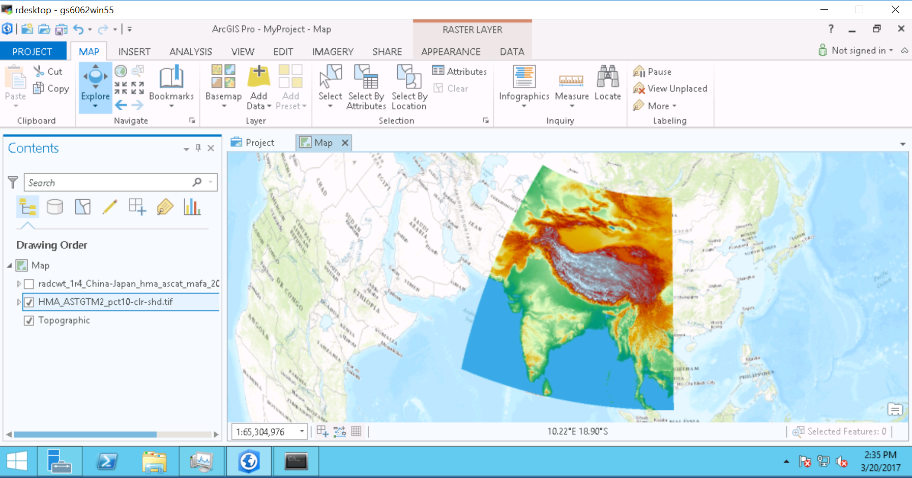

---

title: "NASA ADAPT: Windows VM"
teaching: 10
exercises: 0
questions:
- "How do I access the ADAPT Windows VM?"
- "How do I visualize raster data using ArcGIS PRO?"
objectives:
- "Learn how to navigate ADAPT for those familiar with Windows environment"
- "Learn advantages/disadvantages of Windows VM for HiMAT project work"
keypoints:
- "ADAPT provides a Windows interface for access to HiMAT data. The primary advantage is taking advantage of GIS software tools."

---

## Access to the Windows VM

Connections to the Windows VM are not set up for HiMAT users by default. Send an e-mail to support@nccs.nasa.gov to request credentials to use the Windows VM. You will receive a username and password that is separate from your existing credentials. You will also be assigned the name of a specific VM for connection.
 Note that this is different from being able to access one of the 15 Linux VMs.

## Start the Windows VM

You should be at a command prompt within ADAPT.  Next, we will establish a Remote Desktop connection to Windows:

I was assigned to the Windows VM called "gs6062win55", so my command will be:
~~~
[aarendt@ngalogin02 ~] $ rdesktop -g 1400x800 gs6062win55
~~~
{: .bash}

Note that the last two numbers will vary between different users. The option "-g" lets us set the geometry of the remote desktop, which I set to 1400 by 800 pixels. You can experiment with different window sizes.

A new window will pop up showing a Windows Login page:

 

 

After entering your Windows Login credentials, you will see the desktop:

 

 

Click on the Windows Start menu icon (lower left corner): 

 

 

## ArcGIS PRO

From the Windows Start menu, type "ArcGIS" and start the ArcGIS PRO software.

 

 

* more information on using ArcGIS on ADAPT

