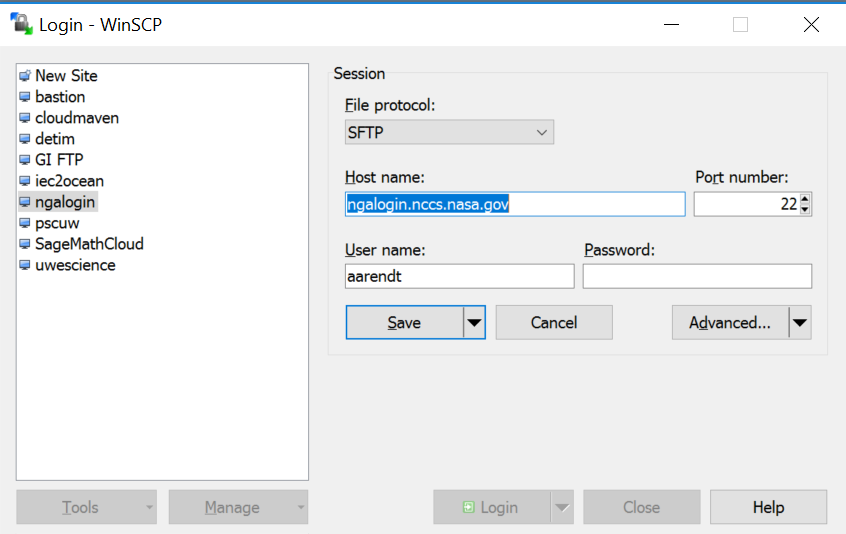
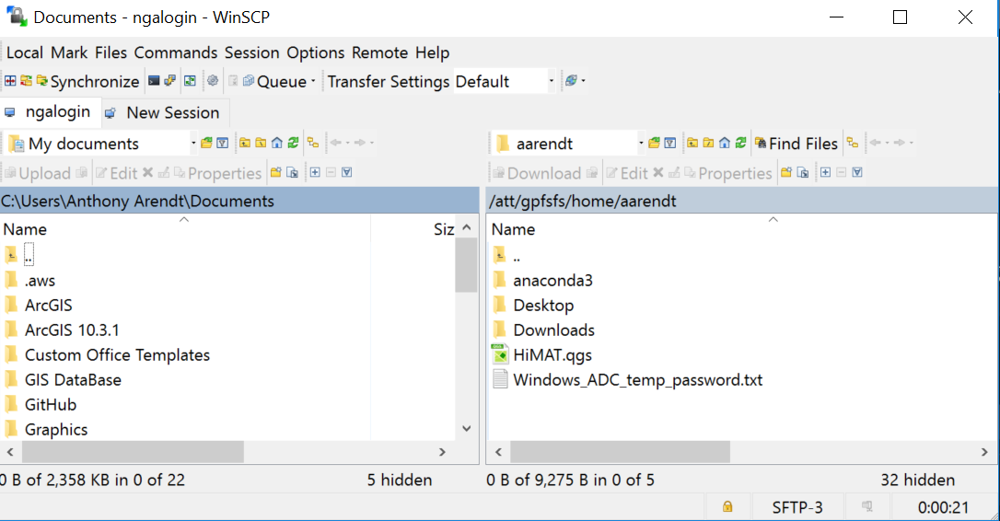

---

title: "Transferring Data to/from ADAPT"
teaching: 5
exercises: 0
questions: 
- "How do I get data on/off of ADAPT?"
objectives:
- "Learn the different ways to transfer data depending on which local operating system you are using"
keypoints:
- "Use standard secure ftp protocols to transfer data to/from your local computer"
- "Use WinSCP if on a Windows platform, and sftp from the command line if on Mac/Linux"

---

## Overview

We encourage carrying out processing and analysis within the ADAPT environment, and minimizing the transfer of files between your local computer and ADAPT servers. Nevertheless there are cases where you need to transfer data, for example if you subset files on ADAPT and transfer them to your computer for additional processing. 

The method you use to transfer data will depend on the operating system of your local computer.

### MAC or Linux

Use scp or sftp to transfer files, e.g.:

~~~
sftp aarendt@ngalogin.nccs.nasa.gov
~~~
{: .bash}

You then enter your credentials and can transfer files via the command line.

### Windows

We recommend using [WinSCP](https://winscp.net/eng/index.php). Enter the host and userID as follows:

 

 

You will then be prompted for your passcode and password. Once connected, you can drag and drop files between the two machines:

 

 

