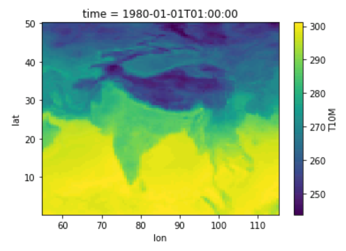

---

title: "Python Examples"
teaching: 15
exercises: 0
questions: 
- "What are typical ways to use Python for visualizing and processing HiMAT data?"
objectives:
- "Use the xarray Python library to subset and plot some MERRA2 data stored on ADAPT"
keypoints:
- "ADAPT is a good environment for pre-processing of HiMAT datasets using open source toolkits."

---

## Introduction

This lesson provides an example of how to use a simple Python script within ADAPT to visualize and subset a gridded climate product.

We will use the following ADAPT resources:

* Windows VM
* Python 3.6 installed in local user directory ([Anaconda](https://geohackweek.github.io/Introductory/00-conda-tutorial/) distribution) and running Jupyter Notebook

We will use one day of MERRA2 data, located on the ADAPT storage drive:

```
/att/pubrepo/MERRA2/local/M2I1NXASM.5.12.4/1980/01/MERRA2_100.inst1_2d_asm_Nx.19800101.nc4
```

## Read and visualize the data

We will use the Python library xarray to examine the MERRA2 product. Start by importing the library:
 
~~~
import xarray as xr
~~~
{: .python}

Next, open the dataset (here the data are located in my "nobackup" folder on the Windows VM):

~~~
ds = xr.open_dataset(r'i:\ppl\aarendt\MERRA2_100.inst1_2d_asm_Nx.19800101.nc4', engine='netcdf4')
~~~
{: .python}

We can examine the contents of this file just by querying the contents of the *ds* variable:

~~~
ds
~~~
{: .python}

~~~
<xarray.Dataset>
Dimensions:  (lat: 361, lon: 576, time: 24)
Coordinates:
  * lon      (lon) float64 -180.0 -179.4 -178.8 -178.1 -177.5 -176.9 -176.2 ...
  * lat      (lat) float64 -90.0 -89.5 -89.0 -88.5 -88.0 -87.5 -87.0 -86.5 ...
  * time     (time) datetime64[ns] 1980-01-01 1980-01-01T01:00:00 ...
Data variables:
    DISPH    (time, lat, lon) float64 0.0 0.0 0.0 0.0 0.0 0.0 0.0 0.0 0.0 ...
    PS       (time, lat, lon) float64 6.877e+04 6.877e+04 6.877e+04 ...
    QV10M    (time, lat, lon) float64 0.0003715 0.0003715 0.0003715 ...
    QV2M     (time, lat, lon) float64 0.0003698 0.0003698 0.0003698 ...
    SLP      (time, lat, lon) float64 9.971e+04 9.971e+04 9.971e+04 ...
    T10M     (time, lat, lon) float64 244.4 244.4 244.4 244.4 244.4 244.4 ...
    T2M      (time, lat, lon) float64 244.2 244.2 244.2 244.2 244.2 244.2 ...
    TO3      (time, lat, lon) float64 322.3 322.3 322.3 322.3 322.3 322.3 ...
    TOX      (time, lat, lon) float64 0.006922 0.006922 0.006922 0.006922 ...
    TQI      (time, lat, lon) float64 0.0001546 0.0001546 0.0001546 ...
    TQL      (time, lat, lon) float64 0.0005524 0.0005524 0.0005524 ...
    TQV      (time, lat, lon) float64 0.6907 0.6907 0.6907 0.6907 0.6907 ...
    TROPPB   (time, lat, lon) float64 3.555e+04 3.555e+04 3.555e+04 ...
    TROPPT   (time, lat, lon) float64 3.555e+04 3.555e+04 3.555e+04 ...
    TROPPV   (time, lat, lon) float64 3.381e+04 3.381e+04 3.381e+04 ...
    TROPQ    (time, lat, lon) float64 5.231e-05 5.231e-05 5.231e-05 ...
    TROPT    (time, lat, lon) float64 223.5 223.5 223.5 223.5 223.5 223.5 ...
    TS       (time, lat, lon) float64 243.7 243.7 243.7 243.7 243.7 243.7 ...
    U10M     (time, lat, lon) float64 1.903 1.928 1.952 1.978 2.002 2.027 ...
    U2M      (time, lat, lon) float64 1.466 1.485 1.503 1.522 1.54 1.559 ...
    U50M     (time, lat, lon) float64 2.64 2.677 2.715 2.752 2.791 2.829 ...
    V10M     (time, lat, lon) float64 -1.59 -1.562 -1.533 -1.504 -1.476 ...
    V2M      (time, lat, lon) float64 -1.186 -1.163 -1.14 -1.117 -1.094 ...
    V50M     (time, lat, lon) float64 -2.362 -2.323 -2.283 -2.243 -2.204 ...
Attributes:
    History: Original file generated: Sat May 31 18:20:30 2014 GMT
    Comment: GMAO filename: d5124_m2_jan79.inst1_2d_asm_Nx.19800101.nc4
    Filename: MERRA2_100.inst1_2d_asm_Nx.19800101.nc4
    Conventions: CF-1
    Institution: NASA Global Modeling and Assimilation Office
    References: http://gmao.gsfc.nasa.gov
    Format: NetCDF-4/HDF-5
    SpatialCoverage: global
    VersionID: 5.12.4
    TemporalRange: 1980-01-01 -> 2016-12-31
    identifier_product_doi_authority: http://dx.doi.org/
    ShortName: M2I1NXASM
    GranuleID: MERRA2_100.inst1_2d_asm_Nx.19800101.nc4
    ProductionDateTime: Original file generated: Sat May 31 18:20:30 2014 GMT
    LongName: MERRA2 inst1_2d_asm_Nx: 2d,3-Hourly,Instantaneous,Single-Level,Assimilation,Single-Level Diagnostics
    Title: MERRA2 inst1_2d_asm_Nx: 2d,3-Hourly,Instantaneous,Single-Level,Assimilation,Single-Level Diagnostics
    SouthernmostLatitude: -90.0
    NorthernmostLatitude: 90.0
    WesternmostLongitude: -180.0
    EasternmostLongitude: 179.375
    LatitudeResolution: 0.5
    LongitudeResolution: 0.625
    DataResolution: 0.5 x 0.625
    Source: CVS tag: GEOSadas-5_12_4
    Contact: http://gmao.gsfc.nasa.gov
    identifier_product_doi: 10.5067/3Z173KIE2TPD
    RangeBeginningDate: 1980-01-01
    RangeBeginningTime: 00:00:00.000000
    RangeEndingDate: 1980-01-01
    RangeEndingTime: 23:00:00.000000
~~~
{: .bash}

This is a nice illustration of a properly documented NetCDF file.

We can quickly visualize one time slice of the data as follows. Let's look at the air temperature variable:

~~~
ds['T10M'][0,:,:].plot()
~~~
{: .python}

<br>

<br>

We expect a typical use of ADAPT scripts will be to subset existing data for the HMA region. Using Python, we can use the "slice" method:

~~~
ds['T10M'].sel(lat=slice(0,50),lon=slice(55,115),time="1980-01-01T01:00:00").plot()
~~~
{: .python}

<br>

<br>


